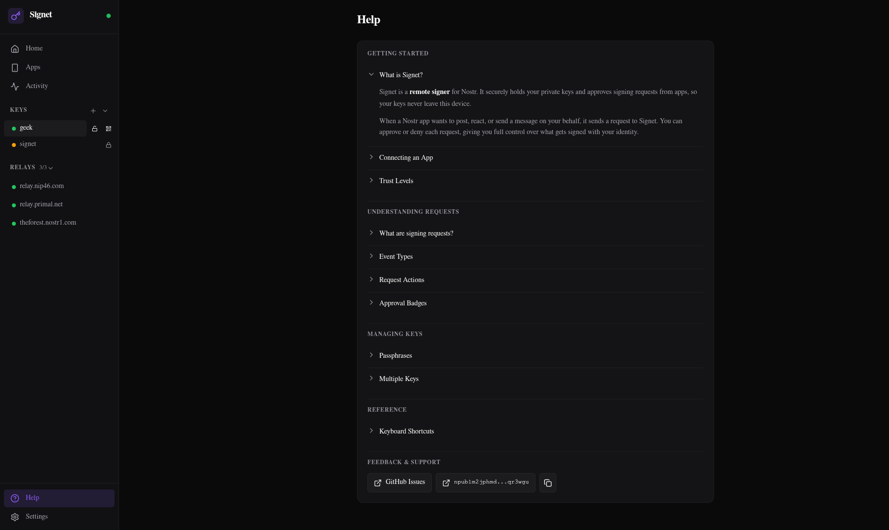

# Signet

A modern NIP-46 remote signer for Nostr. Manages multiple keys securely with a web dashboard for administration. This project was originally forked from [nsecbunkerd](https://github.com/kind-0/nsecbunkerd), but has since received an extensive rewrite.

## Screenshots




## Quick Start (Docker)

```bash
git clone https://github.com/Letdown2491/signet
cd signet
pnpm install
# If you plan to run the daemon with the web dashboard
docker compose up --build
# Or if you plan to run the daemon with the Android app
docker compose up --build signet
```

- Daemon + REST API will run on `http://localhost:3000`
- Web dashboard will run on `http://localhost:4174`. The web dashboard is not required if you plan to manage Signet using the Android app.

If you prefer to add keys directly through the CLI:

```bash
docker compose run --rm signet add --name main-key
```

## Development Setup

**Prereqs:** Node.js 20+, pnpm

```bash
git clone https://github.com/Letdown2491/signet
cd signet
pnpm install
```

Start the daemon:

```bash
cd apps/signet
pnpm run build
pnpm run prisma:migrate
pnpm run signet start
```

Optionally, you could add keys and start the daemon from the CLI with a specific key directly:

```bash
cd apps/signet
pnpm run build
pnpm run prisma:migrate
# Add a key via CLI (prompts for passphrase and nsec, optional if using web dashboard or Android app)
pnpm run signet add --name main-key
# Start with a key already unlocked (prompts for passphrase, optional if using web dashboard or Android app)
pnpm run signet start --key main-key
```

Start the UI dev server (in a separate terminal, optional if using Android app):

```bash
cd apps/signet-ui
pnpm run dev
```

Open `http://localhost:4174` to access the dashboard. From there you can add keys, connect apps, and manage signing requests. Note that this is not required if you plan to manage keys and signing approvals via the Android app.

## Configuration

Config is auto-generated on first boot at `~/.signet-config/signet.json`.

See [docs/CONFIGURATION.md](docs/CONFIGURATION.md) for all options.

## Security

Keys are encrypted with AES-256-GCM (PBKDF2, 600k iterations). API endpoints require JWT auth with CORS and rate limiting.

See [docs/SECURITY.md](docs/SECURITY.md) for the full security model.

## Documentation

- [Configuration Reference](docs/CONFIGURATION.md) - All config options
- [Deployment Guide](docs/DEPLOYMENT.md) - Tailscale, reverse proxies, etc.
- [Security Model](docs/SECURITY.md) - Security architecture and threat model
- [API Reference](docs/API.md) - REST API endpoints
- [Android App](docs/ANDROID.md) - Setup and building the mobile app
